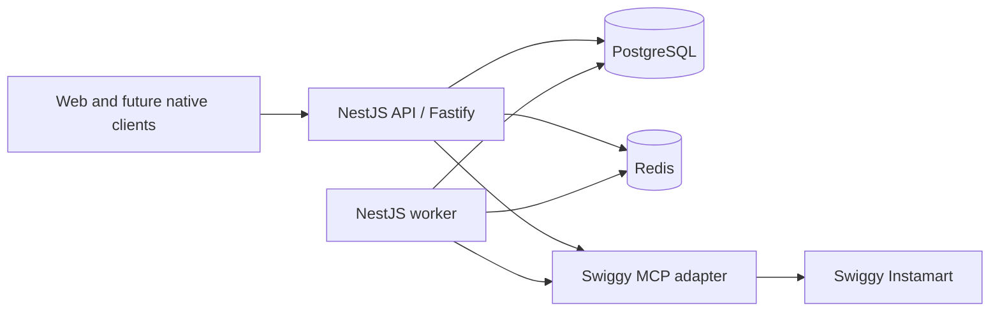
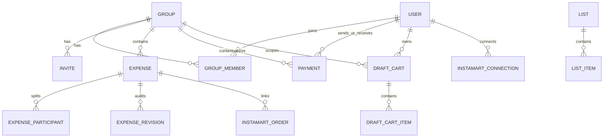

# SwigSplit Unified Backend Architecture

## Purpose

SwigSplit is a shared-expense product with an optional Swiggy Instamart shopping flow. The backend is the single source of truth for identity, memberships, expenses, payments, balances, draft carts, and audit history. Web and future native clients use the same versioned API.

## Chosen stack

| Concern | Choice |
| --- | --- |
| Language | TypeScript |
| HTTP framework | NestJS using the Fastify adapter |
| Database | PostgreSQL |
| Database access | Prisma for schema, migrations, and ordinary persistence; tested SQL queries/views for balance aggregation |
| Short-lived state and jobs | Redis + BullMQ |
| External commerce | Server-side Swiggy MCP adapter using OAuth 2.1 + PKCE |
| API style | JSON REST under `/v1` |

NestJS supplies modules, dependency injection, guards, and validation. Fastify supplies the HTTP server, request logging, compression, and rate-limiting integration.

## System boundaries



The browser never receives Swiggy tokens. No AI is allowed to decide or execute money or cart changes: user intent is explicit and deterministic TypeScript code invokes Swiggy MCP tools.

## Modules

| Module | Owns |
| --- | --- |
| Auth | SMS verification through Redis, sessions, access/refresh tokens |
| Users | Verified user profile returned by `GET /v1/user` |
| Groups | Groups, invitations, active/removed membership, 20-member active limit |
| Expenses | Current expense, exact shares, edits, soft deletion, revisions |
| Payments | Pairwise full/partial settlements |
| Balances | Derived pairwise and group balances; never a mutable balance record |
| Lists | Personal and group reusable product lists |
| Draft carts | Personal per-user/per-group carts held by SwigSplit |
| Instamart | OAuth, addresses, products, cart sync, checkout, order links |
| Activity / notifications | Durable timeline and in-app notification records |
| Worker / outbox | Reliable asynchronous follow-up work |

## API conventions

- Every endpoint is under `/v1`.
- `GET /v1/user` identifies the authenticated SwigSplit user.
- Authentication uses `POST /v1/auth/send-verification-code` and `POST /v1/auth/verify-verification-code`.
- Protected calls use `Authorization: Bearer <access-token>`.
- Financial mutation calls use a new random `Idempotency-Key` UUID for each logical user action. A retry of that same action reuses its original key.
- Expense edits contain the latest `version` read by the client. A stale version receives `409 Conflict` and current data.
- The API accepts amounts in exact decimal rupee strings, for example `"240.00"`. The backend converts them to paise and stores only integer paise.
- Expense and payment amounts must be between ₹1 and ₹100,000 inclusive.
- `PATCH` updates only sent fields; it does not replace the entire resource.

## Financial model

`expenses` holds the current global state: title, total, date, payer, optional group, source, version, and deletion state. `expense_participants` holds only current participant-specific state: user and exact share. `expense_revisions` holds immutable past snapshots and is never used for current balances.

```text
Active expense shares + payments = derived balance
```

Rules enforced in a transaction:

1. Expense amount is positive and within the product limit.
2. An expense has one payer and one or more verified participants.
3. Exact participant shares equal the stored amount exactly.
4. A payment is positive and cannot have the same sender and recipient.
5. Deleted expenses remain in history but are excluded from active balance calculations.

## Core schema relationships



The interactive table-level diagram is at [SwigSplit schema explorer](swigsplit-schema-explorer.html).

## Membership and carts

- `group_members` has one row per group/user. Removal changes it to `removed`; re-adding changes it back to `active`, clears `removed_at`, and updates `last_joined_at`.
- Activity records retain every invitation, removal, and re-add event.
- A group may have zero carts. Each user may have zero or one active cart in a group, enforced by a partial unique index on `(group_id, owner_user_id)` for active carts.
- A group may have at most 20 active members. Adding or re-adding locks the group inside a transaction, counts active members, then inserts/reactivates only if a slot exists.

## Checkout state model

```mermaid
stateDiagram-v2
  [*] --> building
  building --> ready_for_payment: user opens cart review; Swiggy validates cart/address
  ready_for_payment --> requires_cart_review: unavailable item, changed price, or invalid address
  ready_for_payment --> pending_payment: user clicks Checkout; payment starts
  pending_payment --> payment_failed
  pending_payment --> order_confirmed: provider confirms payment/order
  building --> provider_unavailable: Swiggy technical failure
  provider_unavailable --> building: retry later
  requires_cart_review --> building: user corrects cart
```



`building` means the user is still adding, removing, or changing cart items. When the user opens the cart to review it, Swiggy validates the cart/address and the state becomes `ready_for_payment`; the final payable amount and payment options are then visible. `pending_payment` begins only when the user clicks Checkout and Swiggy starts a UPI intent/QR or another provider payment flow.

`requires_cart_review` is a cart issue: unavailable item, changed price, or invalid address. `provider_unavailable` is a Swiggy technical issue such as a timeout, unreachable API, or provider error; it does not mean an item is missing. In either case, the saved draft remains intact.

A pending payment creates a checkout record, not an active expense. Once Swiggy confirms the final amount and order, one transaction creates the expense, shares, order link, activity events, notifications, and outbox work. A failed payment leaves the draft intact and creates no expense.

## Request and background work

```text
Fastify request ID / CORS / body limit / rate limit
  → Nest authentication guard
  → request schema validation
  → group/resource authorization
  → controller
  → service transaction
  → JSON response
```

The service writes `outbox_events` in the same transaction as a successful money change. The worker later reads them to safely deliver notifications, retry temporary provider reads, expire verification state, and refresh payment/order status. The worker never repeats an irreversible checkout without its stored idempotency context.

## Security and operations

- Use short-lived access tokens and rotating, hashed refresh tokens.
- Keep OTP hashes/attempts/expiry in Redis; update `users.phone_verified_at` only after success.
- Rate-limit OTP requests by phone number and IP address.
- Encrypt Swiggy access and refresh tokens at rest.
- Explicitly allow only approved CORS origins.
- Never log tokens, OTPs, or payment details.
- Provide `/health` for process liveness and `/ready` for PostgreSQL/Redis readiness.
- Keep secrets in environment-specific secret storage, never source control.

## MVP testing scope

Keep automated testing focused on the highest-risk behavior:

1. Share sum and ₹1–₹100,000 validation.
2. Create/edit/delete expense and partial-payment balance calculation.
3. Active/removed membership permissions and the 20-member cap.
4. Version conflict and idempotency duplicate prevention.
5. Mocked Swiggy checkout success creates one expense; failed checkout preserves the draft and creates none.

Use a small manual Swiggy staging checklist for the initial prototype.

## Directory structure

```text
apps/
  api/src/
    main.ts
    app.module.ts
    modules/{auth,users,groups,expenses,payments,balances,lists,draft-carts,instamart,activity,notifications}/
    shared/{config,database,auth,errors,validation,idempotency,encryption,logging}/
  worker/src/
    main.ts
    worker.module.ts
    jobs/{outbox,notifications,instamart}/
packages/
  database/prisma/
  shared/src/
tests/{unit,integration,e2e}/
docs/
```

## Implementation order

1. Foundation: workspace, NestJS/Fastify API, worker, Prisma/PostgreSQL, Redis, environment validation, logging, global error format, health endpoints, and test harness.
2. Identity and groups: Redis OTP flow, sessions, `GET /v1/user`, group creation, invitations, membership lifecycle, and 20-member enforcement.
3. Financial core: expenses, current participant shares, revisions, idempotency, payments, and derived balance queries.
4. User-visible records: activity, notification records/outbox, lists, and personal draft carts.
5. Instamart: Swiggy OAuth, typed MCP adapter, search, addresses, validation, payment options, checkout states, payment confirmation, and order linkage.
6. Final MVP readiness: Home aggregates, staging checklist, backup/recovery check, production configuration, and household pilot.
